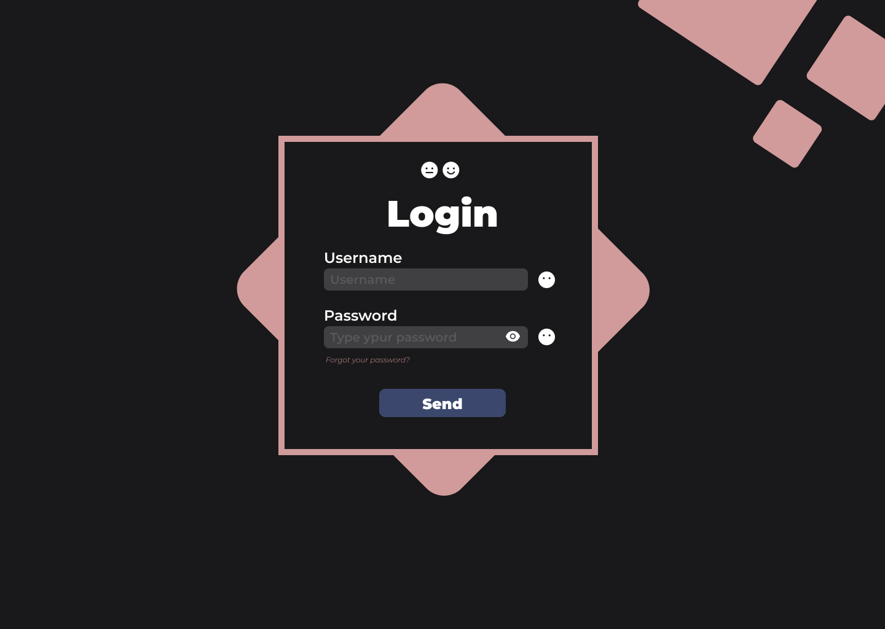

# Rep. público de Maxwel Nascimento

### Pequenos projetos feitos para estudos das linguagens: *Html*, *Css*, *javaScript*, *jQuery* ...

## Tela de Login



Projeto feito para aprender mais sobre **javaScript**, aprendendo mais sobre ```function```, ```addEventListener``` dentre outras coisas.
O alinhamento foi feito com CSS puro, usando mais *display: flex;*. Usei também *jQuery* só para colocar os *Toarts* que são os alert que coloquei, de padrão eles já vem pré-configurados só basta fazer uns pequenos ajustes para poder se adpatar a sua página do jeito que você quiser.

Design da tela:
> **Figma**

Editor de texto:
> **vsCode**

Para acessar a página e ver como ficou, [basta clicar aqui!](https://maxwelnascimento.github.io/telaDeLogin/)

Para acessar o repositório dessa página, [basta clicar aqui!](https://github.com/MaxwelNascimento/telaDeLogin)

> Tela será atualizada mais pra frente , assim que meus conhecimentos e experiência crescerem!


Rubbele Otica, [basta clicar aqui!](https://maxwelnascimento.github.io/OtticaRubeleFicticio/) 

Form cadastro, [basta clicar aqui!](https://maxwelnascimento.github.io/FormCracha/)

NortiN,        [basta clicar aqui!](https://maxwelnascimento.github.io/NortiN/)

